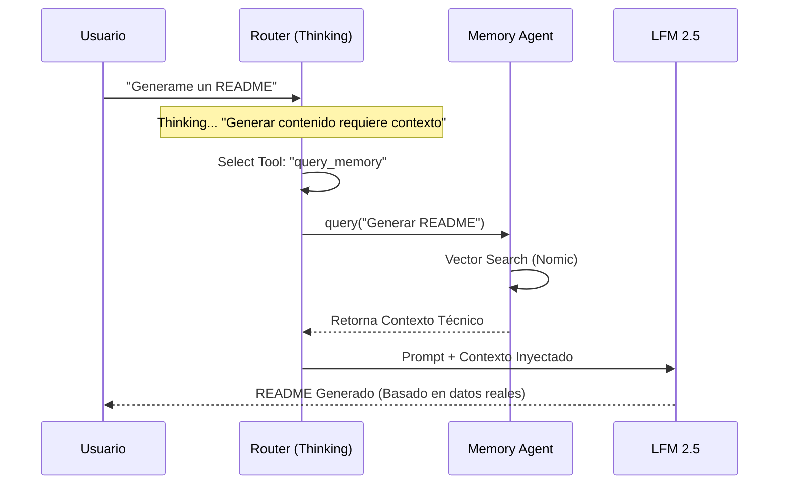

# Arquitectura de IA V3: Thinking RAG System

Este documento describe la arquitectura de la versión 2.4.0 (Reasoning), que introduce el protocolo de "Pensamiento" (Chain of Thought) y la integración autónoma de RAG (Retrieval-Augmented Generation).

## 1. Visión General del Flujo

El sistema ya no dispara herramientas reactivamente. Ahora sigue un ciclo cognitivo estricto:

```mermaid
graph TD
    User[Usuario] -->|Input| Router[Intent Router]
    
    subgraph "Thinking Agent (Router)"
        Router -->|1. Think| Thought[Generar Pensamiento]
        Thought -->|2. Reason| Reasoning[Justificar Necesidad]
        Reasoning -->|3. Select| ToolSelect[Seleccionar Herramienta]
    end
    
    ToolSelect -->|Query Memory| Memory[MemoryV3 (Vector Store)]
    ToolSelect -->|Read File| FileSystem[Sistema de Archivos]
    ToolSelect -->|Chat| Chat[Respuesta Conversacional]
    
    Memory -->|Contexto Inyectado| SystemPrompt[Prompt del Sistema]
    FileSystem -->|Contenido Archivo| SystemPrompt
    
    SystemPrompt -->|Generación| LLM[LFM 2.5 Model]
    LLM -->|Respuesta Final| User
```

## 2. Componentes Clave

### A. Intent Router (El Cerebro)
*   **Ubicación**: `src/renderer/js/services/ai/IntentRouter.js`
*   **Función**: Procesa todo input del usuario.
*   **Novedad**: Parsea un campo `thought` extraído del JSON de respuesta.
*   **Logs**: `[BRAIN] Thinking: "..."` permite ver el proceso mental en tiempo real.

### B. Prompt Builder (La Lógica)
*   **Ubicación**: `src/renderer/js/services/promptBuilder.js`
*   **Cambio Crítico**: Implementación de la "Regla Imperativa".
    > "IMPERATIVE: If your thought mentions 'context', 'information'... YOU MUST SELECT 'query_memory'."
*   **Estructura CoT**:
    ```json
    {
      "thought": "El usuario quiere X, por lo tanto necesito Y...",
      "tool": "tool_id"
    }
    ```

### C. Memory Agent (RAG)
*   **Ubicación**: `src/renderer/js/services/memory/MemoryAgent.js`
*   **Motor**: Nomic Embed Text v1.5 (Puerto 8001).
*   **Flujo**:
    1. Recibe query semántica (ej: "contexto del proyecto").
    2. Genera vector (embedding).
    3. Busca similitud coseno en la base de datos vectorial local.
    4. Devuelve chunks relevantes (`systemContext`) que se inyectan silenciosamente en la sesión.

## 3. Verificación y Testing

Para garantizar la estabilidad del sistema de razonamiento, se han creado scripts específicos en `scripts/`:

| Script | Propósito | Comando |
|--------|-----------|---------|
| `verify_rag_flow.js` | Simulación completa (End-to-End) usando los servicios reales de la App. | `node scripts/verify_rag_flow.js` |
| `verify_reasoning.js` | Test unitario aislado del Prompt Logic. Verifica que el modelo obedezca las reglas de pensamiento sin dependencias de UI. | `node scripts/verify_reasoning.js` |
| `tools/ultimate_multitier_tracer.mjs` | Auditoría forense completa. Genera un `SUMMARY.json` con todos los eventos cognitivos y logs de tráfico. | `node scripts/tools...` |

## 4. Diagrama de Secuencia (Thinking Flow)


