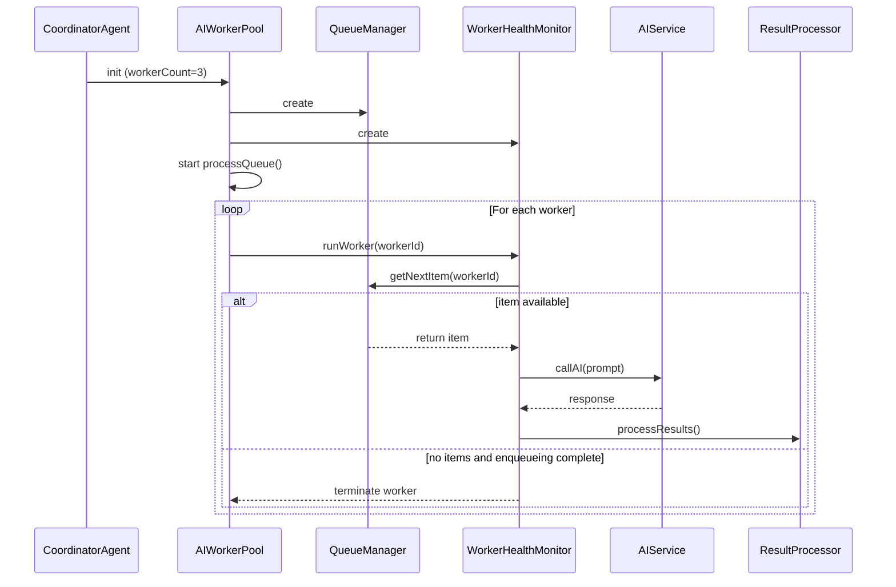
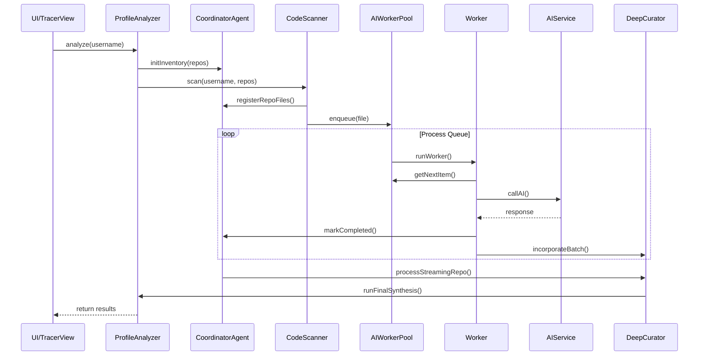

# GitTeach Architecture Overview

## Executive Summary

GitTeach is a sophisticated Electron-based application that analyzes GitHub profiles and repositories to generate technical identities. The architecture consists of a main process handling IPC communications and services, a renderer process managing the AI analysis pipeline, and a curation system that transforms raw findings into comprehensive technical profiles. The system employs a well-structured data flow with clear separation of concerns, parallel processing capabilities, and layered persistence strategies.

## System Architecture

### Main Process (Electron)

The main process serves as the orchestrator for all system operations, managing IPC handlers and coordinating services. Key components include:

#### IPC Handlers
- **Authentication Handler** (`authHandler.js`): Manages OAuth flows and authentication status
- **Profile Handler** (`ProfileHandler.js`): Retrieves and updates GitHub profile data
- **Repository Handler** (`RepoHandler.js`): Handles repository operations and file access
- **Commit Handler** (`CommitHandler.js`): Manages commit analysis and diffs
- **System Handler** (`SystemHandler.js`): Performs utility operations and AI health checks
- **Cache Handler** (`cacheHandler.js`): Manages multiple caching layers
- **Debug Handler** (`debugHandler.js`): Handles debugging and logging
- **Fleet Handler** (`fleetHandler.js`): Monitors AI server fleet status

#### Service Dependencies
```
[Renderer Process]
       |
       | (IPC Calls)
       v
[IPC Handlers] <-----> [IpcWrapper.js]
    |                         |
    |-------------------------|
    |
    v
[Services Layer]
    |
    |-------------------------|
    |                         |
[authService.js]        [profileService.js]
    |                         |
    |                         |
[OAuthFlowManager]      [githubClient.js]
[TokenManager]          [RequestStrategy]
                        [RepoDataAccessor]
    |                         |
    |-------------------------|
              |
              v
        [githubClient.js]
              |
              |
    [RequestStrategy.js]
              |
              |
    [RepoDataAccessor.js]
              |
              |
    [WorkflowGenerator.js]
              |
              |
    [repoService.js]
              |
              |
        [CacheService.js]
              |
              |
    [LevelDBManager.js]
    [FileCacheManager.js]
    [SessionScopedCache.js]
    [DiskMirrorService.js]
              |
              |
    [aiMonitorService.js] <--> [BrowserWindow]
    [aiFleetService.js] <-----> [FleetMonitor.js]
                                [SlotManager.js]
                                [HealthChecker.js]
                                [FleetBroadcaster.js]
              |
              |
        [firewallService.js]
```

### Renderer Process (AI Pipeline)

The renderer process implements the AI analysis pipeline with several key stages:

#### Pipeline Stages
1. **File Selection**: CodeScanner identifies files with PriorityEngine calculating priorities
2. **Analysis**: AIWorkerPool manages configurable workers with QueueManager maintaining priority-sorted queues
3. **Curation**: DeepCurator processes findings and IntelligenceSynthesizer generates cognitive profiles

#### Worker Lifecycle


## Data Flow

### Main Process Data Flow
- Authentication flow: `github:login` → `authHandler.js` → `authService.js` → `OAuthFlowManager.js` → External OAuth
- Profile operations: `github:get-user` → `ProfileHandler.js` → `profileService.js` → `githubClient.js` → GitHub API
- Repository operations: `github:list-repos` → `RepoHandler.js` → `repoService.js` → `RepoDataAccessor.js` → `githubClient.js` → GitHub API
- Cache operations: Various cache operations → `cacheHandler.js` → `cacheService.js` → `LevelDBManager.js` or `SessionScopedCache.js`

### Renderer Pipeline Data Flow


### Curation Data Flow
Raw findings → InsightPartitioner → InsightsCurator → SynthesisOrchestrator → Technical Identity

## Curator & Synthesis Lifecycle

### Input: Raw Findings Structure
```javascript
{
  repo: "repository-name",
  file: "path/to/file",
  path: "path/to/file",
  summary: "brief summary of the file",
  uid: "unique identifier",
  workerId: "worker identifier",
  classification: "technical strength category",
  file_meta: { /* file metadata */ },
  metadata: { /* additional metadata */ },
  params: {
    insight: "detailed insight about the code",
    technical_strength: "strength level",
    evidence: "supporting evidence",
    tags: ["array", "of", "relevant", "tags"]
  },
  timestamp: "ISO timestamp"
}
```

### Curation Stages
1. **Partition Stage**: InsightPartitioner divides insights into Architecture, Habits, and Stack layers
2. **Aggregate Stage**: InsightsCurator performs "The Funnel of Truth" - filtering, deduplication, weighting
3. **Synthesize Stage**: SynthesisOrchestrator coordinates thematic mapping and DNA synthesis

### Output: Technical Identity Structure
```javascript
{
  thought: "Internal reasoning about the developer's architecture and patterns",
  bio: "2-3 sentences describing the developer's technical profile",
  traits: [
    {
      name: "trait name",
      score: integer score (0-100),
      details: "explanation of the trait",
      evidence: "supporting evidence",
      evidence_uids: ["array", "of", "memory", "node", "uids"]
    }
  ],
  distinctions: [
    {
      signal: "the signal detected",
      badge: "badge name",
      justification: "why this badge was awarded"
    }
  ],
  signature_files: ["array", "of", "signature", "files"],
  code_health: {
    logic_integrity: integer (0-100),
    knowledge_integrity: integer (0-100),
    details: "explanation of code health"
  },
  verdict: "developer classification",
  tech_radar: {
    adopt: ["technologies", "to", "adopt"],
    trial: ["technologies", "to", "trial"],
    assess: ["technologies", "to", "assess"],
    hold: ["technologies", "to", "hold"]
  },
  extended_metadata: {
    social_score: number,
    security_score: number,
    testability_score: number,
    dominant_stack_maturity: string
  },
  professional_context: {
    quality_index: string,
    ecosystem_profile: string,
    collaboration_style: string,
    seniority_vibe: string,
    code_churn: string
  },
  resilience_context: {
    error_discipline: string,
    defensive_posture: string,
    optimization: string,
    top_antipatterns: ["array", "of", "antipatterns"]
  },
  anomalies: [
    {
      trait: "trait name",
      impact: "impact level",
      evidence: "supporting evidence"
    }
  ],
  presentation: {
    logic_radar: [{ label: string, score: integer }],
    knowledge_radar: [{ label: string, score: integer }],
    seniority_badges: [
      {
        name: string,
        description: string,
        signal: string
      }
    ]
  }
}
```

### Memory Management
- **Layered Persistence Manager**: Handles granular metadata storage for repository blueprints, thematic layers, and identity broker
- **Cache Repository**: Unified interface for file, repo, and identity caches
- **Streaming Handler**: Manages real-time processing with accumulation and blueprint generation

## Improvement Roadmap

### High Priority Improvements
1. **Streaming Processing**: Implement continuous, real-time processing of pipeline events using reactive streams
2. **Memory Management**: Optimize particle system cleanup and implement efficient garbage collection
3. **Event Prioritization**: Add priority queues to maintain system responsiveness

### Medium Priority Improvements
1. **Lazy Loading**: Implement virtual scrolling and on-demand data loading
2. **Worker Pool Optimization**: Create dynamic scaling based on system load
3. **Event Filtering**: Reduce system noise through intelligent filtering

### Low Priority Improvements
1. **Event Replay Capability**: Enable debugging through event replay
2. **Advanced Load Balancing**: Implement sophisticated resource allocation algorithms

### Implementation Timeline
- **High Priority**: 6-9 weeks (Streaming Processing: 3-4 weeks, Memory Management: 2-3 weeks, Event Prioritization: 1-2 weeks)
- **Medium Priority**: 4-6 weeks (Lazy Loading: 2-3 weeks, Worker Pool: 3-4 weeks, Event Filtering: 1-2 weeks)
- **Low Priority**: 4-6 weeks (Event Replay: 2-3 weeks, Load Balancing: 2-3 weeks)

## Appendix: Key Data Structures

### Inventory Stage
```javascript
{
  repos: [{
    name: string,
    fullName: string,
    language: string,
    files: [{
      path: string,
      sha: string,
      size: number,
      type: 'blob'|'tree',
      status: 'pending'|'processing'|'completed'|'failed'|'skipped',
      priority: number
    }],
    status: 'pending',
    treeSha: string
  }],
  totalFiles: number,
  analyzedFiles: number,
  completedFiles: [],
  failedFiles: []
}
```

### Queue Stage
```javascript
{
  repo: string,
  path: string,
  content: string,
  sha: string,
  status: 'pending'|'assigned'|'processing'|'completed'|'failed',
  priority: number,
  file_meta: object
}
```

### Worker Processing Stage
```javascript
{
  repo: string,
  path: string,
  summary: string,
  workerId: number,
  classification: string,
  metadata: object,
  tags: string[],
  params: object,
  file_meta: object,
  durationMs: number
}
```

### Final Results Stage
```javascript
{
  username: string,
  repos: array,
  aiInsight: object,
  langData: object,
  codeInsights: array,
  audit: object,
  performance: object
}
```