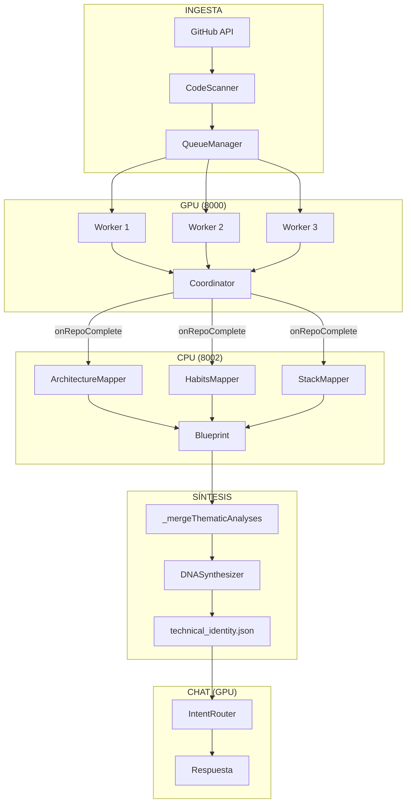

# Arquitectura de IA V4: Dual GPU/CPU Pipeline

Este documento describe la arquitectura de la versión 2.23.0, que introduce procesamiento paralelo real con servidores dedicados GPU y CPU.

## 1. Infraestructura de Hardware

| Recurso | Servidor | Puerto | Uso |
|---------|----------|--------|-----|
| GPU (8GB VRAM) | LFM 2.5 Q8 | 8000 | Workers + Chat |
| CPU (6 threads) | LFM 2.5 Q8 | 8002 | Thematic Mappers |
| CPU (1 thread) | Nomic Embed | 8001 | RAG/Embeddings |

---

## 2. Pipeline de Procesamiento



---

## 3. Flujo Temporal (Paralelo Real)

```
Tiempo ──────────────────────────────────────────────────►

GPU:  ████ Repo1 ████ Repo2 ████ Repo3
           │         │         │
CPU:       ███       ███       ███
        Mappers   Mappers   Mappers
           │         │         │
           └─────────┴─────────┴──► DNA Final
```

Los **mappers ejecutan en paralelo** mientras los workers siguen minando.

---

## 4. Componentes Clave

### A. AIService.callAI_CPU (Nuevo)
- **Ubicación**: `services/aiService.js`
- **Función**: Endpoint dedicado para CPU (puerto 8002)
- **Sin SlotManager**: CPU gestiona sus propios slots

### B. StreamingHandler (Modificado)
- **Ubicación**: `curator/StreamingHandler.js`
- **Cambio**: `synthesizeBlueprint` ahora llama a `ThematicMapper` cuando hay 5+ insights
- **Resultado**: Blueprint incluye `thematicAnalysis`

### C. SynthesisOrchestrator (Optimizado)
- **Ubicación**: `curator/SynthesisOrchestrator.js`
- **Cambio**: Verifica blueprints con análisis pre-calculados
- **Nuevo método**: `_mergeThematicAnalyses()` combina análisis

---

## 5. Estructura de Datos

### Worker Output (por archivo)
```json
{
  "summary": "Descripción técnica...",
  "logic": { "solid": 4, "modularity": 5 },
  "knowledge": { "clarity": 4, "discipline": 4 },
  "signals": { "semantic": 4, "resilience": 3 },
  "resilience_forensics": { "error_discipline": 3 }
}
```

### Blueprint (por repo)
```json
{
  "repoName": "GitTeach",
  "thematicAnalysis": {
    "architecture": { "analysis": "...", "evidence_uids": [] },
    "habits": { "analysis": "...", "evidence_uids": [] },
    "stack": { "analysis": "...", "evidence_uids": [] }
  }
}
```

---

## 6. Scripts de Verificación

| Script | Propósito |
|--------|-----------|
| `start_brain_gpu.bat` | Servidor GPU (workers+chat) |
| `start_brain_cpu.bat` | Servidor CPU (mappers) |
| `ultimate_multitier_tracer.mjs` | Auditoría forense completa |

---

## 7. Métricas de Rendimiento

| Métrica | Antes (Serial) | Después (Paralelo) |
|---------|----------------|-------------------|
| CPU Idle | ~90% | ~20% |
| Context Size | 100+ insights | ~30/repo |
| Tiempo Total | GPU + CPU | max(GPU, CPU) |
