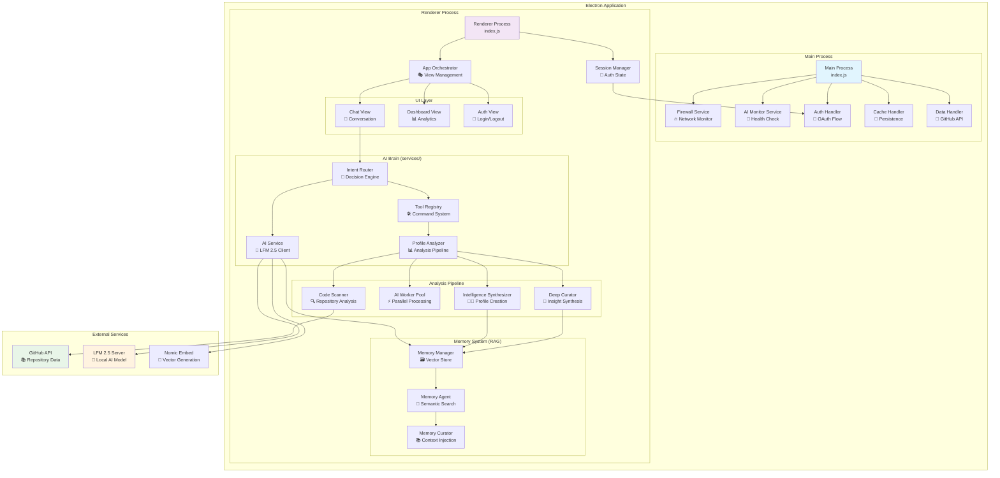
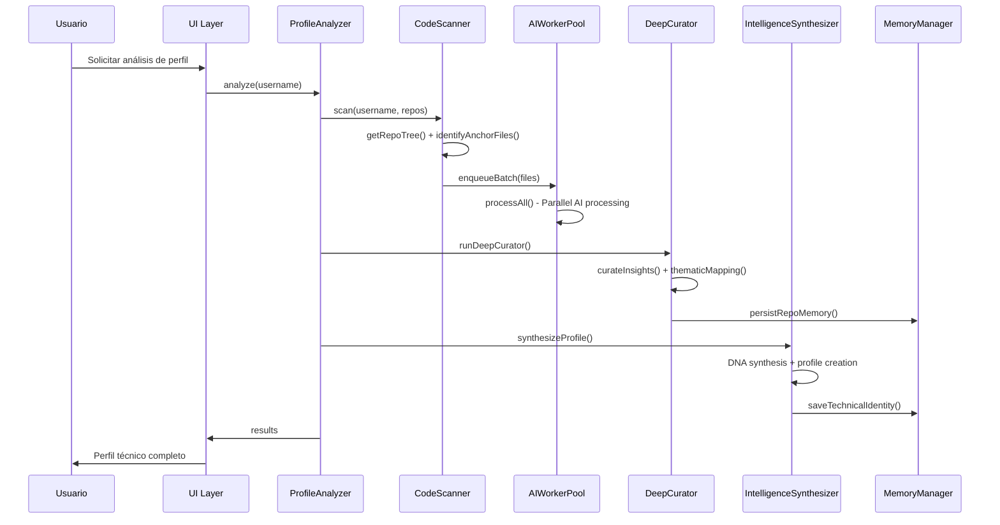
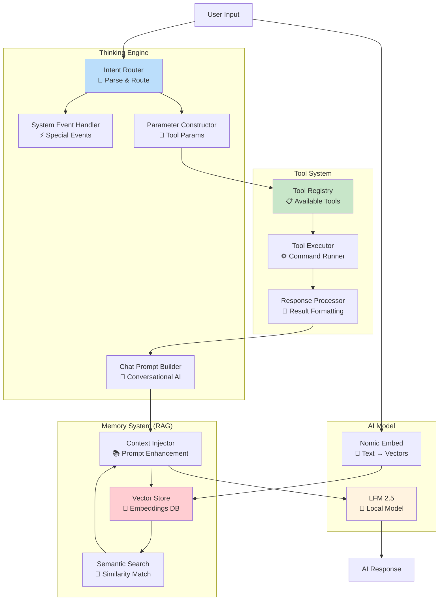
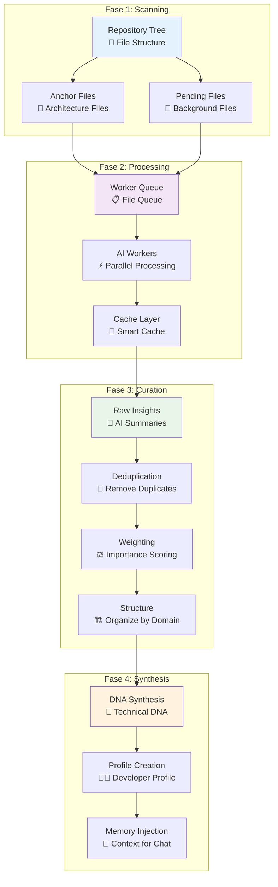
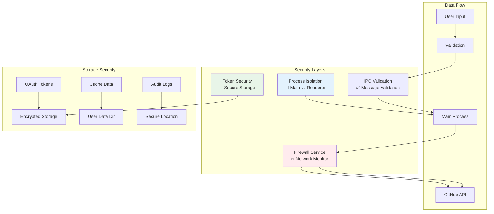
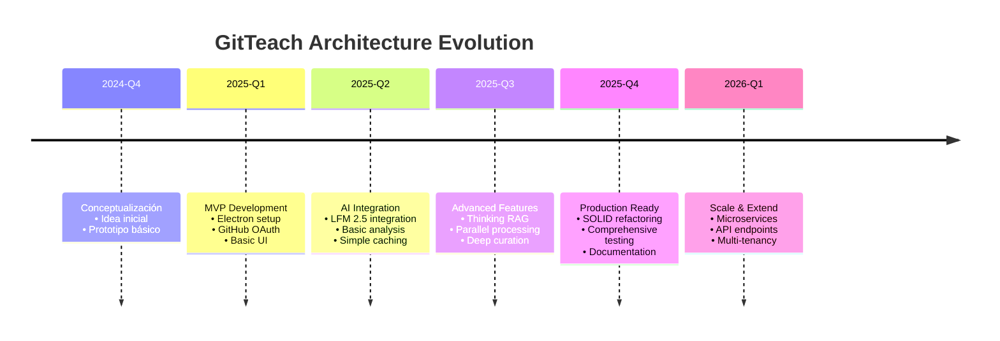

# Diagramas de Arquitectura - GitTeach

## 🏛️ **Arquitectura General del Sistema**



## 🔄 **Flujo de Análisis de Perfil**



## 🧠 **Sistema de IA: Thinking RAG Architecture**



## 📊 **Pipeline de Análisis de Código**



## 🔐 **Arquitectura de Seguridad**



## 📈 **Métricas de Rendimiento**

```mermaid
gantt
    title Performance Timeline
    dateFormat HH:mm
    axisFormat %H:%M

    section App Startup
    Main Process Init    :done, m1, 00:00, 00:30
    Renderer Load       :done, m2, 00:30, 01:00
    AI Server Health    :done, m3, 01:00, 01:30

    section Profile Analysis
    Repository Scan     :done, p1, 02:00, 05:00
    AI Processing       :done, p2, 05:00, 15:00
    Deep Curation       :done, p3, 15:00, 18:00
    Profile Synthesis   :done, p4, 18:00, 20:00

    section Memory Operations
    Vector Storage      :done, mem1, 20:00, 21:00
    Context Injection   :done, mem2, 21:00, 22:00
    RAG Ready          :done, mem3, 22:00, 23:00
```



## 🏗️ **Evolución Arquitectónica**



## 🎯 **Decisiones Arquitectónicas Clave**

| Decisión | Razón | Alternativa Considerada |
|----------|--------|------------------------|
| **Electron** | Desktop app con web technologies | React Native, Tauri |
| **Local AI** | Privacidad total, sin APIs externas | OpenAI API, Anthropic |
| **ESM Modules** | Modern JavaScript, tree shaking | CommonJS, bundlers |
| **SOLID Principles** | Mantenibilidad a largo plazo | Quick & dirty approach |
| **Vector RAG** | Contexto semántico inteligente | Keyword search, rule-based |
| **Process Separation** | Seguridad y estabilidad | Single process (menos seguro) |

## 📋 **Límites del Sistema**

```mermaid
graph TD
    subgraph "Current Limits"
        REPOS[Max 500 repos<br/>por análisis]
        FILES[Max 50,000 archivos<br/>en cola]
        MEMORY[150MB RAM<br/>con modelos cargados]
        TIMEOUT[180s timeout<br/>por llamada AI]
    end

    subgraph "Scaling Considerations"
        HORIZONTAL[Horizontal Scaling<br/>🚀 Múltiples instancias]
        VERTICAL[Vertical Scaling<br/>💪 Más RAM/GPU]
        CACHING[Cache Optimization<br/>⚡ Redis/external DB]
        MICROSERVICES[Microservices Split<br/>🔧 AI independiente]
    end

    REPOS --> HORIZONTAL
    FILES --> VERTICAL
    MEMORY --> MICROSERVICES
    TIMEOUT --> CACHING
