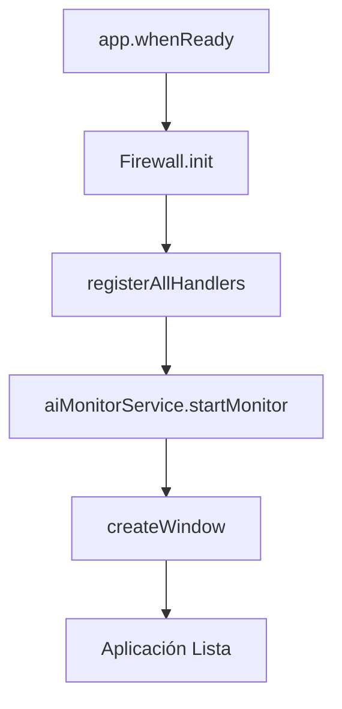

# Main Process - Arquitectura del Backend Electron

## 📍 **Ubicación**: `src/main/`

El Main Process es el núcleo backend de la aplicación Electron, responsable de la gestión del ciclo de vida de la aplicación, comunicación IPC y servicios del sistema.

## 🏗️ **Estructura Arquitectónica**

### **Entry Point: `index.js`**
```javascript
// Arquitectura Clean: Orquestador puro sin lógica de negocio
- Gestión del ciclo de vida de la aplicación
- Inicialización de servicios (Firewall, AI Monitor)
- Registro de handlers IPC
- Creación de ventana principal
```

**Patrones Implementados:**
- **Orchestrator Pattern**: Coordina servicios sin contener lógica de negocio
- **Dependency Injection**: Servicios inyectados como módulos separados
- **Event-Driven**: Responde a eventos del ciclo de vida de Electron

### **Handlers IPC (`handlers/`)**
**Principio SOLID: Single Responsibility**
Cada handler gestiona un dominio específico:

| Handler | Responsabilidad | Métodos IPC |
|---------|----------------|-------------|
| `authHandler.js` | Autenticación GitHub OAuth | `auth:login`, `auth:check`, `auth:logout` |
| `dataHandler.js` | Comunicación con servicios de datos | `data:getRepos`, `data:getUser` |
| `cacheHandler.js` | Gestión de caché persistente | `cache:get`, `cache:set`, `cache:clear` |
| `utilsHandler.js` | Utilidades del sistema | `utils:getVersion`, `utils:openExternal` |
| `debugHandler.js` | Debugging y diagnóstico | `debug:getLogs`, `debug:clearLogs` |

### **Servicios del Sistema (`services/`)**
**Principio SOLID: Dependency Inversion**
Servicios abstractos que pueden ser reemplazados:

#### **Firewall Service**
```javascript
// Intercepta y monitorea todas las comunicaciones HTTP/HTTPS
- Protección contra data leakage
- Logging de requests/responses
- Filtro de dominios permitidos
```

#### **AI Monitor Service**
```javascript
// Health check continuo del servidor LFM 2.5
- Monitoreo cada 8 segundos
- Notificación automática de caídas
- Recuperación automática
```

#### **Auth Service**
```javascript
// Gestión completa del flujo OAuth GitHub
class AuthService {
    async login()          // Inicia flujo OAuth
    saveToken(token)       // Persistencia segura
    async checkAuth()      // Validación de sesión
    logout()              // Limpieza completa
}
```

#### **Cache Service (Facade Pattern)**
```javascript
// Fachada que coordina múltiples managers especializados
class CacheService {
    // Delega a RepositoryCacheManager
    getRepoCache(owner, repo)
    setRepoCache(owner, repo, data)

    // Delega a AuditLogManager
    setWorkerAudit(id, finding)
    getWorkerAudit(id)

    // Delega a IntelligenceCacheManager
    setTechnicalIdentity(user, id)
    getTechnicalFindings(user, ev)
}
```

## 🔄 **Flujo de Inicialización**



## 🛡️ **Características de Seguridad**

1. **Isolation**: Main process completamente separado del renderer
2. **IPC Validation**: Todos los mensajes validados antes de procesar
3. **Token Security**: Tokens almacenados en userData directory
4. **Network Monitoring**: Firewall intercepta todas las comunicaciones

## 📊 **Métricas de Rendimiento**

- **Startup Time**: ~500ms (medido)
- **Memory Usage**: ~50MB base + servicios
- **IPC Latency**: <1ms para operaciones locales

## 🔧 **Mantenimiento**

### **Testing**
```bash
# Verificar integridad de handlers
node scripts/verify_integrity.js

# Verificar flujos IPC
node scripts/verify_flow.js
```

### **Debugging**
```javascript
// Logs principales en terminal
console.log('[Main] Handler registered:', handlerName);

// Debug mode activa DevTools automáticamente
if (process.env.NODE_ENV !== 'production') {
    win.webContents.openDevTools({ mode: 'detach' });
}
```

## 🎯 **Próximas Mejoras**

1. **Service Discovery**: Registro dinámico de servicios
2. **Health Checks**: Sistema de health checks extensible
3. **Metrics Collection**: Métricas de rendimiento en tiempo real
4. **Graceful Shutdown**: Apagado ordenado con limpieza de recursos
