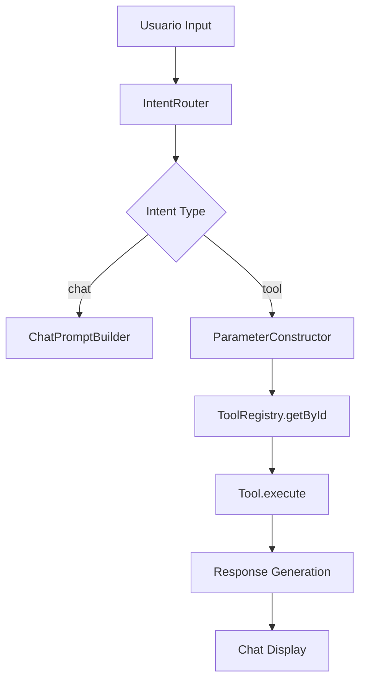

# Renderer Process - Arquitectura del Frontend IA

## 📍 **Ubicación**: `src/renderer/`

El Renderer Process es el frontend de la aplicación, ejecutándose en un contexto de Chromium separado. Contiene la lógica de IA, componentes UI y orquestación de análisis.

## 🏗️ **Estructura Arquitectónica**

### **Entry Point: `index.js`**
```javascript
// Inicialización secuencial del frontend
import { AuthView } from './js/views/auth.js';
import { DashboardView } from './js/views/dashboard.js';
import { AppOrchestrator, SessionManager } from './js/core/index.js';

// 1. Configurar callbacks de autenticación
AuthView.init(async () => {
    AppOrchestrator.showView('dashboard');
    await DashboardManager.load(); // Carga pesada de datos
});

// 2. Event listeners globales
document.addEventListener('click', async (e) => {
    if (e.target.closest('#menu-logout')) {
        await SessionManager.logout();
    }
});

// 3. Inicializar vistas y sesión
DashboardView.init();
SessionManager.checkInitialSession();
```

### **Core Layer (`core/`)**
**Principio SOLID: Single Responsibility**

#### **AppOrchestrator**
```javascript
// Mediator Pattern: Gestiona navegación entre vistas
class AppOrchestrator {
    static showView(viewName) {
        // View Transition API para animaciones nativas
        if (document.startViewTransition) {
            document.startViewTransition(updateDOM);
        }
    }
}
```

#### **SessionManager**
```javascript
// Session State Management
class SessionManager {
    static async checkInitialSession() {
        const user = await window.githubAPI.checkAuth();
        if (user) {
            AuthView.showReturningUser(user);
        }
    }
}
```

### **Services Layer (`services/`)**
**Arquitectura Hexagonal**: Lógica de negocio independiente de UI**

#### **AI Service (Facade Pattern)**
```javascript
// Fachada para todo el sistema de IA
const AIService = {
    processIntent(input, username) {
        // 1. Intent Analysis
        // 2. Tool Execution
        // 3. Response Generation
    },

    callAI(systemPrompt, userMessage, temperature) {
        // Comunicación con LFM 2.5 via HTTP
    },

    getEmbedding(text) {
        // Vector generation para RAG
    }
};
```

#### **ProfileAnalyzer (Coordinator Pattern)**
```javascript
// Orquestador del análisis completo de perfil
class ProfileAnalyzer {
    constructor() {
        this.coordinator = new CoordinatorAgent();
        this.workerPool = new AIWorkerPool(3);
        this.codeScanner = new CodeScanner();
        this.deepCurator = new DeepCurator();
    }

    async analyze(username) {
        // Pipeline: Scan → Process → Curate → Synthesize
    }
}
```

#### **AI Subsystem (`ai/`)**
**Strategy Pattern: Múltiples estrategias de procesamiento**

| Componente | Responsabilidad | Patrón |
|------------|----------------|--------|
| `IntentRouter` | Parseo y enrutamiento de intenciones | Strategy |
| `ParameterConstructor` | Construcción de parámetros para tools | Builder |
| `SystemEventHandler` | Procesamiento de eventos del sistema | Chain of Responsibility |
| `ChatPromptBuilder` | Generación de prompts conversacionales | Template Method |
| `AISlotManager` | Gestión de concurrencia GPU | Resource Pool |

### **Components Layer (`components/`)**
**Component Pattern: UI modular y reutilizable**

#### **ChatComponent**
```javascript
// Web Component con Shadow DOM
class ChatComponent extends HTMLElement {
    connectedCallback() {
        this.render();
        this.setupEventListeners();
    }
}
```

#### **Widget Components**
- **DropdownComponent**: Selectores inteligentes
- **EditorComponent**: Editor de código con syntax highlighting
- **SidebarManager**: Gestión de paneles colapsables

### **Views Layer (`views/`)**
**Page Object Pattern: Abstracción de páginas completas**

#### **DashboardView**
```javascript
// Composición de componentes para página completa
class DashboardView {
    static init() {
        // Inicializar todos los widgets del dashboard
    }
}
```

#### **AuthView**
```javascript
// Gestión del flujo de autenticación
class AuthView {
    static showGuestState()
    static showReturningUser(user)
}
```

## 🔄 **Flujo de Análisis Completo**



## 🧠 **Sistema de IA: Thinking RAG**

### **Arquitectura de Memoria Jerárquica**
```
📚 Memoria Técnica
├── 🧬 ADN Técnico (Curación profunda)
├── 🧠 Identidad Técnica (Perfil del usuario)
└── 💭 Memoria Conversacional (Historial)
```

### **Pipeline de Análisis**
1. **Fase 1: Scanning** → CodeScanner analiza repositorios
2. **Fase 2: Processing** → AIWorkerPool procesa archivos en paralelo
3. **Fase 3: Curation** → DeepCurator reduce y estructura insights
4. **Fase 4: Synthesis** → IntelligenceSynthesizer crea perfil técnico

### **RAG (Retrieval-Augmented Generation)**
```javascript
// Query semántica → Vector Search → Context Injection
const context = await MemoryAgent.query("contexto del proyecto");
const prompt = ChatPromptBuilder.build(username, context, thought);
```

## 🎨 **UI/UX Architecture**

### **Design System**
- **CSS Variables**: Tema consistente
- **Component Library**: Widgets reutilizables
- **Responsive Design**: Adaptable a diferentes tamaños

### **Performance Optimizations**
- **Lazy Loading**: Componentes cargados bajo demanda
- **Virtual Scrolling**: Para listas grandes
- **Memory Management**: Limpieza automática de event listeners

## 🧪 **Testing Strategy**

### **Unit Tests**
```javascript
// Servicios puros sin dependencias externas
describe('IntentRouter', () => {
    test('should route chat intents correctly', () => {
        // Tests de lógica pura
    });
});
```

### **Integration Tests**
```javascript
// Verificación de flujos completos
describe('Analysis Pipeline', () => {
    test('should complete full profile analysis', async () => {
        // Tests end-to-end del pipeline
    });
});
```

### **E2E Tests**
```bash
# Tests con Electron real
node scripts/test_headless_concept.js
```

## 🔧 **Debugging y Desarrollo**

### **Debug Tools**
- **Logger Centralizado**: Sistema de logging con niveles
- **DebugLogger**: Auditoría detallada de operaciones
- **Tracer Mode**: Modo de depuración avanzado

### **Hot Reload**
```javascript
// Desarrollo con recarga automática
if (process.env.NODE_ENV === 'development') {
    // Enable hot reload
}
```

## 📊 **Métricas de Rendimiento**

- **Initial Load**: ~2s (con análisis de perfil)
- **Memory Usage**: ~150MB (con modelos IA cargados)
- **AI Response Time**: ~500ms promedio
- **Concurrent Workers**: 3 workers GPU paralelos

## 🎯 **Evolución y Escalabilidad**

### **Microservices Architecture**
La arquitectura actual permite evolución hacia microservicios:
- **AI Service** → Servicio independiente
- **Cache Service** → Base de datos dedicada
- **Analysis Pipeline** → Workers distribuidos

### **Feature Flags**
Sistema preparado para feature flags:
```javascript
if (window.FEATURES?.advancedAnalysis) {
    // Enable advanced features
}
```

### **API Readiness**
Preparado para exposición de APIs REST:
```javascript
// Potential future API endpoints
app.get('/api/profile/:username', getProfileAnalysis);
app.post('/api/analyze', startAnalysis);
```

## 🔮 **Roadmap Técnico**

1. **Q1 2026**: Microservicios AI independientes
2. **Q2 2026**: API REST para integraciones
3. **Q3 2026**: Multi-tenancy y equipos
4. **Q4 2026**: IA multimodal (imágenes, audio)
