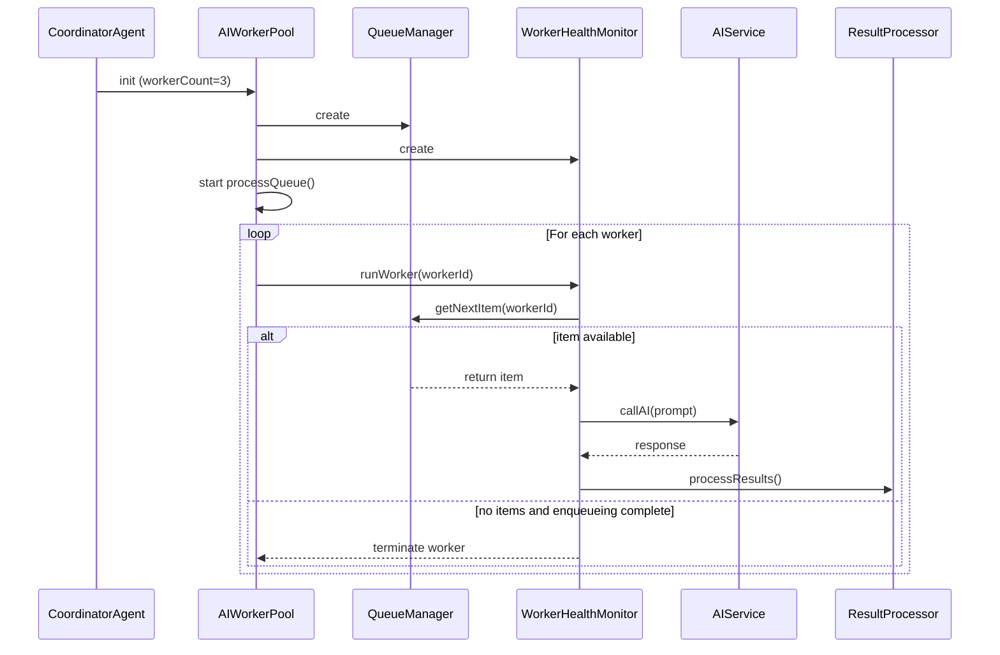
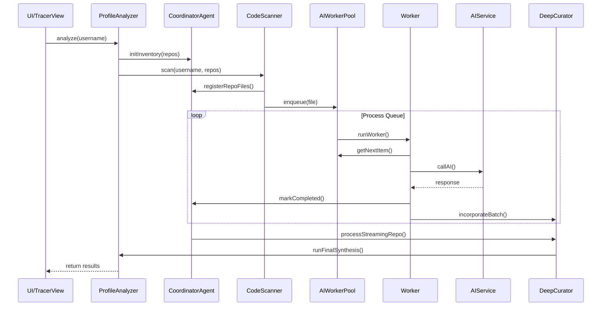

# Data Flow in Renderer Pipeline

## Overview
This document describes the AI analysis pipeline in the renderer process, focusing on how files are processed, worker coordination, and curator flow.

## 1. Pipeline Stages

### Stage 1: File Selection
- **CodeScanner** scans repositories and identifies files to analyze
- **PriorityEngine** calculates file priority based on heuristics (README, package.json, main files have higher priority)
- Files are registered in **InventoryManager** with priority scores
- Maximum file limits are enforced per repository (default: 9999 files)

### Stage 2: Analysis
- **AIWorkerPool** manages a configurable number of workers (default: 3)
- **QueueManager** maintains a priority-sorted queue of files to process
- Workers fetch items from the queue based on:
  - Priority (highest first)
  - Repository distribution (to avoid overloading a single repo)
  - File affinity (related files processed together)
- **WorkerHealthMonitor** tracks worker status and performance
- **ResultProcessor** handles AI responses and error handling

### Stage 3: Curation
- **DeepCurator** processes findings and creates structured insights
- **IntelligenceSynthesizer** generates cognitive profiles from technical data
- **CacheRepository** persists technical identity and findings
- **memoryManager** stores findings in graph memory

## 2. Worker Lifecycle

### Spawn


### Process
1. **Initialization**: Worker registers with WorkerHealthMonitor
2. **Queue Polling**: Worker requests next item from QueueManager
3. **Affinity Management**: Worker maintains repository affinity for context continuity
4. **AI Processing**: Worker sends request to AIService and waits for response
5. **Result Handling**: Worker processes response through ResultProcessor
6. **Callback Updates**: Worker notifies coordinator and other listeners
7. **Loop**: Return to step 2 until queue is empty and enqueueing is complete

### Terminate
- Workers terminate when queue is empty and no more files will be enqueued
- Worker statistics are finalized in WorkerHealthMonitor
- Worker resources are released
- AIWorkerPool waits for all workers to complete before resolving promise

## 3. Event Flow Between Components

### Pipeline Events
- Events are emitted through **PipelineEventBus**
- Events follow the pattern: `{prefix}:{start|end}`
- Examples: `embedding:start`, `ai:gpu:end`, `file:queued`, `file:completed`
- Events are sent to main process via IPC for AIFleetService

### Component Interactions


## 4. Data Structures at Each Stage

### Inventory Stage
```javascript
{
  repos: [{
    name: string,
    fullName: string,
    language: string,
    files: [{
      path: string,
      sha: string,
      size: number,
      type: 'blob'|'tree',
      status: 'pending'|'processing'|'completed'|'failed'|'skipped',
      priority: number
    }],
    status: 'pending',
    treeSha: string
  }],
  totalFiles: number,
  analyzedFiles: number,
  completedFiles: [],
  failedFiles: []
}
```

### Queue Stage
```javascript
{
  repo: string,
  path: string,
  content: string,
  sha: string,
  status: 'pending'|'assigned'|'processing'|'completed'|'failed',
  priority: number,
  file_meta: object
}
```

### Worker Processing Stage
```javascript
{
  repo: string,
  path: string,
  summary: string,
  workerId: number,
  classification: string,
  metadata: object,
  tags: string[],
  params: object,
  file_meta: object,
  durationMs: number
}
```

### Final Results Stage
```javascript
{
  username: string,
  repos: array,
  aiInsight: object,
  langData: object,
  codeInsights: array,
  audit: object,
  performance: object
}
```

## 5. Parallelization Opportunities

### Current Parallelization
- Multiple AI workers operate concurrently (default: 3 workers)
- Workers maintain repository affinity to improve context
- QueueManager balances load across repositories
- Batch processing for small files

### Potential Improvements
- Dynamic worker scaling based on system resources
- Repository-level parallelization for independent repos
- Priority-based queuing to process high-value files first
- Background processing for low-priority files
- Distributed processing across multiple machines/nodes

### Threading Model
- Each worker operates independently in its own execution context
- Shared state is managed through CoordinatorAgent and QueueManager
- Thread-safe operations are coordinated through synchronized methods
- PipelineController manages execution state (play/pause/step/stop)