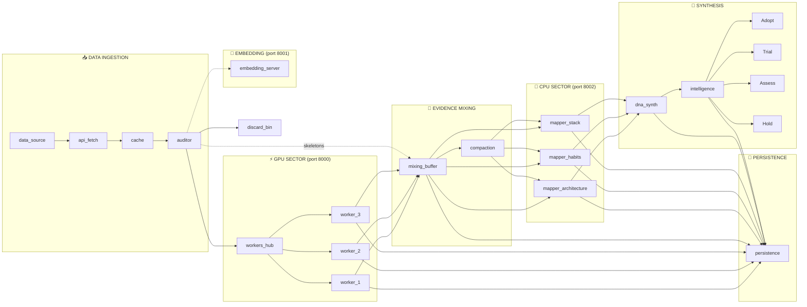

# Flujo de Datos - GitTeach Pipeline

> **Última actualización**: 2026-01-20 05:48  
> **Fuente**: Auditoría Forense de 6 Agentes Qwen (reportes forensic_1 al forensic_6)

Este documento representa la arquitectura física del pipeline, mostrando cómo los archivos se transforman desde GitHub hasta la Identidad Técnica final. Cada nodo principal es una **Fábrica** que contiene clases internas especializadas.

---

## 🏭 Arquitectura de Fábricas



---

## 🏭 Detalle de cada Fábrica

### 1. DATA SOURCE FACTORY
| Nodo | Clases Internas | Eventos Emitidos |
|------|-----------------|------------------|
| `data_source` | - | `repo:detected` |
| `api_fetch` | `RepoTreeFetcher`, `FileDownloader` | `api:fetch`, `repo:tree:fetched` |
| `cache` | `CacheRepository`, `RepoCacheManager`, `FileCacheManager` | `cache:store`, `repo:complete` |

### 2. AUDITOR FACTORY
| Nodo | Clases Internas | Eventos Emitidos |
|------|-----------------|------------------|
| `auditor` | `FileAuditor`, `FindingsCurator`, `FileProcessor`, `FileFilter` | `file:classified`, `file:queued`, `repo:files:extracting` |
| `discard_bin` | (destino terminal) | `file:discarded` |

### 3. GPU WORKERS FACTORY (Port 8000)
| Nodo | Clases Internas | Eventos Emitidos |
|------|-----------------|------------------|
| `workers_hub` | `AIWorkerPool`, `QueueManager`, `CoordinatorAgent` | `repo:batch`, `hub:circuit:open/closed` |
| `worker_1/2/3` | `AISlotManager`, `AIClient`, `ResultProcessor` | `worker:slot:N`, `ai:gpu:start/end`, `file:analyzed` |

> **Configuración**: 4 slots totales (3 workers + 1 reserved para URGENT)   
> **Timeouts**: GPU 180s (4 retries), Circuit breaker abre tras 3 fallos consecutivos

### 4. EMBEDDING FACTORY (Port 8001)
| Nodo | Clases Internas | Eventos Emitidos |
|------|-----------------|------------------|
| `embedding_server` | `EmbeddingService`, `VectorStore` | `embedding:start/end` |

### 5. MIXING BUFFER FACTORY
| Nodo | Clases Internas | Eventos Emitidos |
|------|-----------------|------------------|
| `mixing_buffer` | `StreamingHandler`, `EvidenceStore`, `MemoryManager` | `file:skeletonized`, `streaming:*`, `mixer:gate:locked/unlocked` |
| `compaction` | `RepoContextManager`, `InsightsCurator` | `compaction:*` |

> **Gatekeeper Logic**: `criticalMassReached = richRepos >= 1 || decentRepos >= 2`  
> **Compaction Frequency**: Cada 10 archivos por repositorio

### 6. CPU MAPPERS FACTORY (Port 8002)
| Nodo | Clases Internas | Eventos Emitidos |
|------|-----------------|------------------|
| `mapper_architecture` | `ArchitectureMapper`, `BaseMapper` | `mapper:start/end { mapper: 'architecture' }` |
| `mapper_habits` | `HabitsMapper`, `BaseMapper` | `mapper:start/end { mapper: 'habits' }` |
| `mapper_stack` | `StackMapper`, `BaseMapper` | `mapper:start/end { mapper: 'stack' }` |

> **Ejecución**: `Promise.all()` - Los 3 mappers corren en PARALELO  
> **Input**: Golden Knowledge curado (no raw findings)  
> **Particionamiento**: `InsightPartitioner` divide por semántica

### 7. SYNTHESIS FACTORY (Port 8002)
| Nodo | Clases Internas | Eventos Emitidos |
|------|-----------------|------------------|
| `dna_synth` | `DNASynthesizer`, `SynthesisOrchestrator`, `DNAPromptBuilder`, `DNAParser` | `dna:*` |
| `intelligence` | `IntelligenceSynthesizer`, `GlobalIdentityRefiner` | `synthesis:*`, `profile:*`, `dna:radar:update` |
| `radar_*` | (satélites visuales) | (triggered by `dna:radar:update`) |

### 8. PERSISTENCE FACTORY
| Nodo | Clases Internas | Eventos Emitidos |
|------|-----------------|------------------|
| `persistence` | `LevelDBManager`, `DiskMirrorService`, `SessionManagerService`, `CacheService` | `persist:*` |

> **Arquitectura Dual**: LevelDB (performance) + JSON mirrors (debugging)  
> **Key Schema**: `raw:finding:{repo}`, `mem:node:{uid}`, `meta:blueprint:{repo}`

---

## 📊 Estructura de Datos por Fase

### Rich Finding (Output de Workers)
```javascript
{
  summary: "Descripción textual del archivo...",
  metadata: {
    complexity: 7.5,
    patterns: ["singleton", "factory"],
    signals: { semantic: 0.8, resilience: 0.6, ... }
  },
  params: { insight: "..." },
  file_meta: { path, sha, size, repo }
}
```

### Golden Knowledge (Output de Compaction)
```javascript
{
  synthesis: "Párrafo curado del repositorio...",
  coherence_score: 8.5,
  health_indicators: { ... },
  dominant_patterns: ["MVC", "Repository"],
  tech_stack_signals: ["React", "Node.js"]
}
```

### DNA Profile (Output de DNASynthesizer)
```javascript
{
  bio: "Senior developer con...",
  traits: [{ name: "Modularidad", score: 8.5 }],
  code_health: { logic: 7.8, knowledge: 6.2 },
  tech_radar: { adopt: [], trial: [], assess: [], hold: [] },
  verdict: "Desarrollador sólido en..."
}
```

### Technical Identity (Output Final)
```javascript
{
  title: "Backend Architect",
  bio: "...",
  core_languages: ["JavaScript", "Python"],
  domain: "API Development",
  evolution_snapshot: { ... }
}
```

---

## ⏱️ Eventos del Pipeline

| Evento | Trigger | Nodo Destino |
|--------|---------|--------------|
| `repo:detected` | Nuevo repo encontrado | `data_source`, `cache` |
| `api:fetch` | Descarga de archivo | `api_fetch` |
| `file:classified` | Clasificación de archivo | `auditor` |
| `file:queued` | Encolado para workers | `workers_hub` |
| `ai:gpu:start/end` | Inferencia GPU | `workers_hub` |
| `embedding:start/end` | Generación de embeddings | `embedding_server` |
| `mapper:start/end` | Análisis temático | `mapper_*` (por payload.mapper) |
| `compaction:*` | Condensación de findings | `compaction` |
| `mixer:gate:locked/unlocked` | Gatekeeper state | `mixing_buffer` |
| `dna:*` | Síntesis de perfil | `dna_synth` |
| `file:cache:hit` | SHA duplicado | `mixing_buffer` (shortcut dorado) |
| `hub:circuit:open/closed` | Circuit breaker | `workers_hub` |
| `pipeline:resurrection` | Recuperación de gap | `mixing_buffer` |

---

## 🔧 Puertos de Servidores

| Puerto | Rol | Componentes |
|--------|-----|-------------|
| 8000 | GPU Workers | AIWorkerPool, LFM2.5 Chat |
| 8001 | Embeddings | Vector generation, RAG |
| 8002 | CPU Heavy | Mappers, Compaction, DNASynth |

---

## 📁 Estructura de Persistencia

```
mock_persistence/
├── repos/
│   └── [RepoName]/
│       ├── raw_findings.jsonl      ← JSONL streaming
│       ├── curated_memory.json     ← Nodos de memoria
│       ├── golden_knowledge.json   ← Output de compaction
│       ├── blueprint.json          ← Repo blueprint
│       └── partitions.json         ← Semantic partitions
├── mappers/
│   ├── inputs/
│   ├── outputs/
│   └── history/
├── context_user.json
└── technical_identity.json
```

---

## ⚠️ Blind Spots Identificados

| Área | Issue | Riesgo |
|------|-------|--------|
| Memory | `EvidenceStore.accumulatedFindings` sin cleanup | Leak |
| Race Condition | JSONL append concurrent | Corrupción |
| Orphan Files | Sessions no cleanup | Disco lleno |
| Pipeline | Mapper timeout sin handling | Hang |
| Circuit Breaker | Permanece abierto 60s | Bloqueo |
