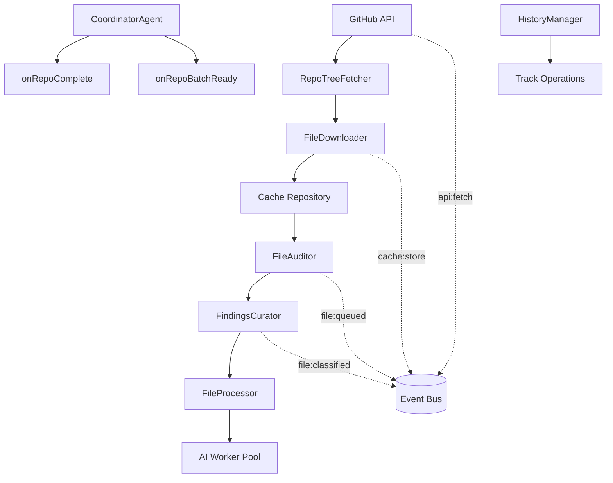

# Forensic Audit Report: Data Ingestion Phase of GitTeach

## Overview
This report provides a comprehensive forensic analysis of the data ingestion pipeline in GitTeach, tracing the path of files from GitHub API to FileAuditor classification. The analysis covers the complete data flow, event emissions, data structures, blind spots, and proposes visualization metrics.

## System Architecture
- **Event Bus**: `pipelineEventBus.emit(event, payload)` - NO POLLING
- **Streaming**: `CoordinatorAgent.onRepoComplete`, `onRepoBatchReady` callbacks
- **History**: `HistoryManager` tracks `{ repo, file, slotId, done }` per node

## Pipeline Flow Diagram


## 1. Exact Path of a File from GitHub API to FileAuditor Classification

### Step-by-step Flow:
1. **GitHub API Request**: The process begins in `RepoTreeFetcher.js` where `window.githubAPI.getFileContent()` is called to download file content from GitHub.

2. **File Download**: In `FileDownloader.js`, the `downloadFile()` method handles the actual download and emits the `api:fetch` event to the pipeline event bus.

3. **Content Processing**: The downloaded content is processed in `processDownloadedContent()` method which decodes the Base64 content and prepares a data structure with content snippet, file path, SHA, and metadata.

4. **Caching**: The file content is cached using `cacheFile()` method in `FileDownloader.js`, which stores the content in the `CacheRepository`.

5. **File Auditing**: The `FileAuditor.js` coordinates the auditing process, checking if the file needs to be downloaded or if it's already in cache.

6. **Classification**: In `FileAuditor.js`, the `identifyAnchorFiles()` method delegates to `FindingsCurator.js` which uses `FileFilter.js` to identify relevant files for analysis.

7. **AI Processing**: The file is enqueued for AI processing via `FileProcessor.js` which adds it to the worker pool if capacity allows.

## 2. Events Emitted (Format and Timing)

### Event Table:
| Event Name | Payload Fields | When Fired |
|------------|----------------|-------------|
| `api:fetch` | `{ repo: repoName, file: filePath, status: 'start'\|'end' }` | When a file download starts and ends from GitHub API |
| `cache:store` | `{ repo: repoName, file: filePath }` | When a file is stored in the cache |
| `file:cached` | `{ repo: repoName, file: filePath }` | When a file is retrieved from cache (instead of downloading) |
| `file:skeletonized` | `{ repo: repoName, file: filePath }` | When a file is processed as a skeleton (bypassing AI processing) |
| `file:queued` | `{ repo: repoName, file: filePath }` | When a file is added to the AI worker queue |
| `file:classified` | `{ file: filePath, repo: repoName }` | When a file is classified as an anchor file |

Additional pipeline events supported by `PipelineEventBus.js`:
- `embedding:start/end` → Port 8001
- `ai:gpu:start/end` → Port 8000
- `ai:cpu:start/end` → Port 8002
- `mapper:start/end` → Port 8002
- `file:queued/completed` → General auditing

## 3. Data Structures at Each Step

### GitHub API Response Structure
```javascript
{
  content: "Base64 encoded content",
  sha: "file-sha-hash",
  file_meta: { /* additional metadata */ }
}
```

### Processed Content Structure (from FileDownloader.processDownloadedContent)
```javascript
{
  contentSnippet: "decoded content (first portion)",
  filePath: "path/to/file",
  sha: "file-sha-hash",
  fileMeta: { /* file metadata from GitHub API */ }
}
```

### File Tree Entry (from RepoTreeFetcher)
```javascript
{
  path: "path/to/file",
  type: "blob",
  sha: "file-sha-hash",
  mode: "patch" // for forked repos
}
```

### Cache Entry Structure
```javascript
{
  contentSnippet: "first 500 chars of content",
  fullContent: "complete decoded content",
  sha: "file-sha-hash",
  file_meta: { /* metadata */ },
  aiSnippet: "processed content for AI" // if processed
}
```

### Inventory Manager Data Structure (CoordinatorAgent)
```javascript
{
  repos: [
    {
      name: "repo-name",
      files: [
        {
          path: "path/to/file",
          status: "pending|completed|failed|skipped",
          summary: "AI-generated summary",
          priority: "numeric priority score",
          rawData: { /* raw analysis data */ }
        }
      ]
    }
  ],
  analyzedFiles: 0,
  totalFiles: 0
}
```

### History Entry Structure (HistoryManager)
```javascript
{
  time: "timestamp",
  repo: "repo-name",
  file: "path/to/file",
  display: "repo-name: path/to/file",
  done: true|false,
  slotId: "worker-slot-id" // for classifier tracking
}
```

## 4. Blind Spots, Undocumented Paths, and Error Handlers

### Blind Spots
- **Cache Bypass Logic**: The code has complex logic to determine if a file needs to be downloaded, but there's no clear documentation on the conditions that would cause a cache miss vs. hit.
- **Silent Failures**: In `FileAuditor.processNewFile`, if `contentRes` or `contentRes.content` is empty, the function returns `null` without logging or notification.
- **Rate Limiting Handling**: The `RepoTreeFetcher.isRateLimited` method checks for rate limit messages, but there's no clear retry mechanism documented.
- **Tracer Mode Limitations**: The code has several conditional behaviors based on `window.IS_TRACER`, but these are not well-documented in terms of their impact on the pipeline.

### Undocumented Paths
- **Fork Repository Analysis**: The code has special handling for fork repositories where it only analyzes files if the user contributed, but this logic isn't clearly documented.
- **High-Fidelity Seed Processing**: The `FileProcessor` has special logic for processing high-fidelity seeds (limited to 5 files in tracer mode), but this isn't well-documented.
- **Skeleton Data Creation**: Files that bypass AI processing get skeleton data created, but this path is not clearly documented in the overall flow.

### Silent Error Handlers
- **File Download Errors**: In `FileAuditor.processNewFile`, errors during file processing are caught and logged to console but don't propagate properly.
- **Cache Operations**: The `CacheRepository` methods are called without proper error handling in many places.
- **Event Emission**: The `pipelineEventBus.emit` method has no error handling if the main process is unavailable.
- **Import Statements**: Several modules use dynamic imports wrapped in try-catch blocks that silently fail, such as in `RepoTreeFetcher.js`.

### Potential Issues
- **Memory Leaks**: The `PipelineEventBus` keeps a history of events with no clear cleanup mechanism.
- **Race Conditions**: Multiple files might be processed simultaneously without proper synchronization in some areas.
- **Missing Validation**: The code doesn't validate the structure of data received from GitHub API consistently.
- **Incomplete State Tracking**: The coordinator tracks completion status but doesn't appear to handle cancellation or interruption scenarios properly.

## 5. Proposed Data to Track Per Node for Visualization

### data_source Node
```javascript
{
  reposCount: 0,           // Total number of repositories processed
  currentRepo: "",         // Name of the currently processing repository
  totalFiles: 0,           // Total number of files across all repos
  processedRepos: [],      // List of processed repository names
  repoDetails: {           // Detailed information per repository
    name: "",
    fileCount: 0,
    isFork: false,
    treeSha: ""
  }
}
```

### api_fetch Node
```javascript
{
  filesCount: 0,           // Total number of files fetched
  downloadSpeed: 0,        // Average download speed in KB/s
  rateLimitHits: 0,        // Number of times rate limit was hit
  errors: 0,               // Number of fetch errors
  successRate: 0,          // Percentage of successful fetches
  avgResponseTime: 0       // Average API response time in ms
}
```

### cache Node
```javascript
{
  hitRate: 0,              // Cache hit percentage
  missRate: 0,             // Cache miss percentage
  repoCards: [],           // Repository cache status cards
  totalCached: 0,          // Total number of cached files
  cacheSize: 0,            // Size of cache in bytes
  evictionCount: 0         // Number of evicted cache entries
}
```

### auditor Node
```javascript
{
  classified: 0,           // Number of files classified as anchor files
  discarded: 0,            // Number of files discarded/not processed
  anchors: [],             // List of identified anchor files
  skeletons: 0,            // Number of files processed as skeletons
  avgProcessingTime: 0,    // Average time to process a file
  totalProcessed: 0        // Total number of files processed by auditor
}
```

### workers_hub/mixing_buffer Node
```javascript
{
  queued: 0,               // Number of items in queue
  processing: 0,           // Number of items currently being processed
  completed: 0,            // Number of completed items
  errors: 0,               // Number of processing errors
  workerUtilization: [],   // Utilization percentage per worker
  throughput: 0            // Items processed per second
}
```

## Summary
The GitTeach data ingestion pipeline follows a well-structured but complex flow involving multiple services that coordinate through an event bus system. While the architecture is generally sound, there are several blind spots and potential error conditions that could lead to incomplete processing or silent failures. The proposed visualization metrics would provide valuable insights into the pipeline's performance and health.