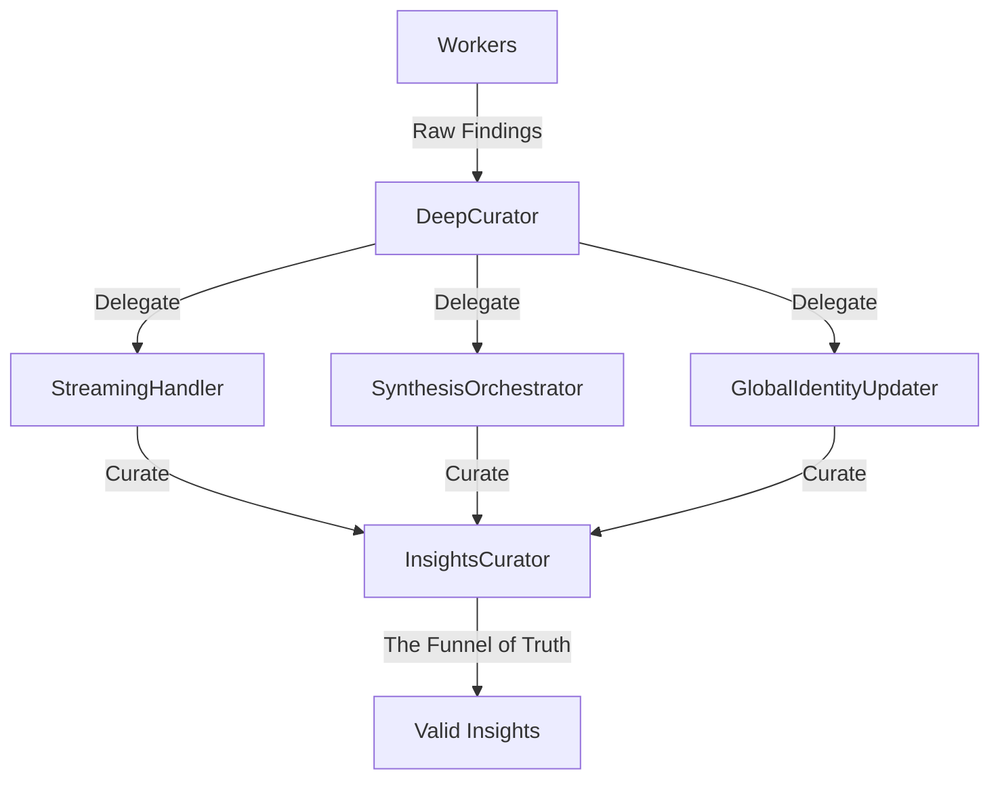

# Contratos del Ecosistema Curator (SOLID)

Este documento define las interfaces y el flujo de datos entre los módulos de curación de Giteach.

## Arquitectura de Curación

## Definiciones de Contrato

### 1. InsightsCurator
**Entrada**: `findings[]` (Array de objetos raw findings).
**Salida**: `{ validInsights[], anomalies[], stats{}, traceability_map{} }`.
**Garantía**: Deduplicación por similitud de Jaccard y cumplimiento de TIER_S.

### 2. InsightPartitioner
**Entrada**: `insights[]` (Array de findings curados).
**Salida**: `{ architecture[], habits[], stack[] }`.
**Garantía**: Saneamiento de campos legacy y clasificación basada en señales semánticas.

### 3. FileFilter
**Entrada**: `tree[]` (GitHub tree objects).
**Salida**: `tree[]` (Filtrado).
**Garantía**: Exclusión de archivos tóxicos (vendor, assets) y priorización de anclas.

## Invariantes de Datos
- Un `finding` debe contener al menos un `summary` o `params.insight`.
- El mapa de trazabilidad debe agruparse por `technical_strength` (o `classification` como fallback).
- Los IDs de archivo (`uid`) deben preservarse durante toda la cadena de curación.

---
*Este documento es parte de la arquitectura v2.33+ de Giteach.*
